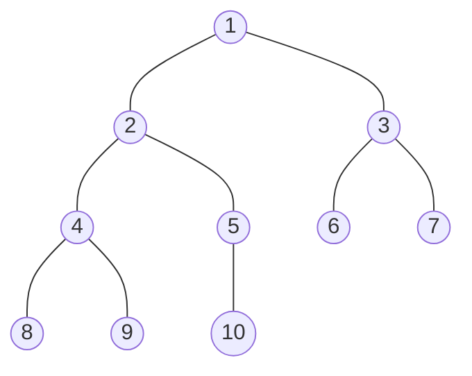

# 8-优先队列


有时候不一定要求全部数组有序，或者不一定要求一次就将它排序。很多时候，我们会收集一些元素，处理当前键值最大的元素，然后再收集更多元素，再处理键值最大元素。

​		这种情况下，一个合适的数据结构应该支持两种操作：删除最大元素和插入元素。这种数据结构叫做优先队列。

优先队列的使用和队列(删除最老的元素)以及栈(删除最新的元素)类似。


## API

优先队列是一种抽象数据类型，它表示了一组值和对这些值的操作。

`public class MaxPQ(Key extends Comparable<Key>)`

| MaxPQ()            | 创建一个优先队列            |
| ------------------ | --------------------------- |
| MaxPQ(int max)     | 创建一个容量为max的优先队列 |
| MaxPQ(Key[] a)     | 用a[]中元素创建一个优先队列 |
| 方法定义           | 方法含义                    |
| void insert(Key v) | 向优先队列中插入一个元素    |
| Key max()          | 返回最大元素                |
| Key delMax()       | 删除最大元素                |
| boolean isEmpty()  | 返回队列是否为空            |
| int size()         | 返回优先队列中的元素个数    |

可以很方便的修改MaxPQ类变成MinPQ类。


## 优先队列的调用实例

为了展示优先队列的抽象模型价值，考虑一个问题：输入N个字符串，每个字符串对应一个整数，从中找出最大的(或者最小的)M个整数。在某些应用场景，输入量可能非常巨大，甚至认为输入是无限的，解决这个问题的一种方法是将输入排序，然后找出最大的M个元素。但已经说明了输入非常巨大。另一种方式是将每个新的输入和已知的M个最大元素比较，但是除非M较小，否则比较的代价也会很高。只要能高效的实现Insert()和delMin()。


| 示例                     | 时间    | 空间 |
| ------------------------ | ------- | ---- |
| 排序算法的用例           | $NlogN$ | N    |
| 调用初级实现的优先队列   | $NM$    | M    |
| 调用基于堆排序的优先队列 | $NlogM$ | M    |


## 初级实现


### 数组实现

​			上述部分API的数组实现

```java
    public void show() {
        for(int i = 0; i < size; i++) {
            System.out.print((Key) a[i] + " ");
        }
    }

    public boolean isEmpty() {
        return size == 0;
    }
    public int size() {
        return this.size;
    }

    private boolean less(Comparable v, Comparable w) {
        return v.compareTo(w) < 0;
    }
    private void exch(Comparable[] a, int i ,int j) {
        Comparable temp = a[i];
        a[i] = a[j];
        a[j] = temp;
    }
```


#### 无序数组


要实现删除最大元素代码，只需要使用类似选择排序的内循环来找出最大值，将最大元素和边界元素交换然后删除它。

所谓 无序数组，就是数组内部是没有排好序的，只在返回最大值或者删除最大值时使用了类似选择排序找出最大值。


##### 代码实现：

```java
import java.util.Arrays;

//使用数组实现优先队列
//无序
public class MaxPQ<Key extends Comparable<Key>> {
    //如果不指定数组长度，默认是10
    private int defalutLength = 10;
    private Comparable[] a;

    // 数组的元素个数
    private Integer size = 0;
    // 数组的容量
    private Integer length;
    public MaxPQ() {
        a = new Comparable[defalutLength];
        length = defalutLength;
    }
    public MaxPQ(int max) {
        a = new Comparable[max];
        length = max;
    }
    public MaxPQ(Key[] a) {
        length = a.length;
        //将数组复制过去
        this.a = new Comparable[length];
        for(int i = 0; i < length; i++) {
            this.insert(a[i]);
        }
    }

    public void insert(Key v) {
        if(size.equals(length)) {
            //如果数组满了，就创建一个是原来长度2倍的数组，把元素复制过去
            a = Arrays.copyOf(a, 2 * length);
            length = 2 * length;
        }
        a[size++] = v;

    }

    public Key max() {
        if(size == 0) {return null;}
        else if(size == 1) {return (Key) a[0];}

        int max = size - 1;
        for(int i = 0; i < size - 1; i++) {
            if(less(a[max], a[i])) {
                max = i;
            }
        }
        if(max != size - 1) {
            exch(a, max, size - 1);
        }
        return (Key) a[size - 1];
    }

    public Key delMax() {
        Key v = max();
        size--;
        return v;
    }


}

```


#### 有序数组

另外一种方法就是在insert方法中，使用插入排序，就是每插入一个元素，就和前面所有元素比较，插入到相应位置。

这样整个数组总是有序的，而且最大元素在数组一边。


##### 代码实现

```java
package example;

import java.util.Arrays;

//使用数组实现优先队列
//有序
public class MaxPQ<Key extends Comparable<Key>> {
    //如果不指定数组长度，默认是10
    private int defalutLength = 10;

    private Comparable[] a;

    // 数组的元素个数
    private Integer size = 0;

    // 数组的容量
    private Integer length;
    public MaxPQ() {
        a = new Comparable[defalutLength];
        length = defalutLength;
    }
    public MaxPQ(int max) {
        a = new Comparable[max];
        length = max;
    }
    public MaxPQ(Key[] a) {
        length = a.length;
        this.a = new Comparable[length];
        for(int i = 0; i < length; i++) {
            this.insert(a[i]);
        }
    }

    public void insert(Key v) {
        if(size.equals(length)) {
            //如果数组满了，就创建一个是原来长度2倍的数组，把元素复制过去
            a = Arrays.copyOf(a, 2 * length);
            length = 2 * length;
        }
        a[size++] = v;

        for(int i = size - 1; i > 0; i--) {
            if(less(a[i], a[i - 1])) {
                exch(a, i, i - 1);
            }
        }


    }

    public Key max() {
        if(size == 0) {
            return null;
        } else {
            return (Key) a[size - 1];
        }

    }

    public Key delMax() {
        Key v = max();
        size--;
        return v;
    }

}

```


### 链表实现

​		使用链表来实现优先队列。使用无序序列是解决这个问题的惰性方法，因为我们仅在必要的时候才会找出最大元素；使用有序序列是解决问题的积极方法，因为会在插入元素时就会保持列表有序。

​		同样，使用链表也有两种方法，一种是链表无序；一种是保持链表始终有序。

有序和无序其实实现方法类似，只不过一个在插入时遍历；另一个在删除时遍历。

所以这里只实现链表无序。

#### 代码实现

```java
import java.util.Arrays;

//使用无序链表实现优先队列
public class MaxPQ<Key extends Comparable<Key>> {

    private class Node {
        Key val;
        Node next;
        public Node(Key val) {
            this.val = val;
        }
    }

    private Node first;

    // 数组的元素个数(链表实现其实可以去掉)
    private Integer size = 0;

    public MaxPQ() {}

    public MaxPQ(Key[] a) {
        size = a.length;
        for(Key v : a) {
            this.insert(v);
        }
    }

    public void insert(Key v) {
        //把元素插入到链表的最前面，不需要关心链表是否为空
        Node oldFirst = first;
        first = new Node(v);
        first.next = oldFirst;
        size++;
    }

    public Key max() {
        if(isEmpty()) {
            return null;
        }
        //使用三个指针，max指向最大值;pre指向最大值的前一个结点
        //i进行循环和max比较
        Node max = first;
        Node pre = first;
        Node i = first;
        //当i指向最后一个元素时，循环结束
        while (i.next != null) {
            if(less(max.val, i.next.val)) {
                //当i指向的结点的下一个结点的值大于max指向结点的值时，
                // 那么pre指向i对应结点，max指向i指向的结点的下一个结点
                pre = i;
                max = i.next;
            }
            i = i.next;
        }
        //结束循环后，i一定指向最后一个结点
        //max指向最大值对应结点，pre指向max的前一个结点
        /*此时分三种情况：
            1. 最大值是第一个结点
            2. 最大值是最后一个结点
            3. 最大值是中间任意一个结点

          对于第一种情况，不需要做任何操作；对于2,3种情况，可以合并在一起解决
        */
        //将最大值挪到链表最前面
        if(max != first) {
            pre.next = max.next;
            max.next = first;
            first = max;

        }
        return first.val;
    }

    public void delMax() {
        Key v = max();
        if(v != null) {
            first = first.next;
        }
    }

    public void show() {
        Node i = first;
        while (i != null) {
            System.out.print(i.val + " ");
            i = i.next;
        }
        System.out.println();
    }

    public boolean isEmpty() {
        return first == null;
    }
    public int size() {
        return this.size;
    }

    private boolean less(Comparable v, Comparable w) {
        return v.compareTo(w) < 0;
    }


}

```


### 优先队列的时间复杂度

​		实现栈或者队列与实现优先队列的最大不同在于对性能的要求，对于栈和队列，我们的实现能够在常数时间完成所有操作。

因为不需要管是否有序。

​		但是对于优先队列，刚刚讨论的所有初级实现，**插入元素**和**删除最大元素**这两个操作之一在最坏情况下需要在线性时间下完成。       而且只要一个操作最坏情况在线性时间完成，另一个操作只需要常数时间。

| 数据结构 | 插入元素 | 删除最大元素 |
| :------: | :------: | :----------: |
| 有序数组 |    N     |      1       |
| 无序数组 |    1     |      N       |
|    堆    |   logN   |     logN     |
| 理想情况 |    1     |      1       |

链表的有序和无序，和数组相同。


## 使用堆来实现

### 堆的定义

​		当一颗二叉树的每个结点都大于等于它的两个子结点时，它被称为堆有序。

​		所以，相应地，在堆有序的二叉树中，从任意结点向上，可以得到一列非递减的元素；从任意结点向下，都能得到一列非递增的元素。

特别地：根结点是堆有序的二叉树中最大的结点。


### 二叉堆的表示法

​		如果使用指针来表示的话，每个结点需要三个指针，来分别指向父结点，和两个子结点。

​		但是如果使用完全二叉树来表示，就会非常方便，完全二叉树不需要指针，数组就可以。具体方法是将二叉树结点按照层级顺序放入数组，根结点在位置一，它的子结点在位置2、3，然后是4、5...以此类推。

​		

​		二叉堆是一组能够用堆有序的完全二叉树排序的元素，并在数组中按照层级储存(**不使用数组的第一个位置，从1开始**)


​		二叉堆简称堆，位置k的结点的父结点的位置为$\lfloor k/2 \rfloor$ (向下取整)，而两个子结点的位置为2k和2k + 1，这样在不使用指针的情况下，直接使用数组索引在树中上下移动。



注意：一颗大小为N的二叉树的高度为$\lfloor lgN \rfloor$(向下取整)，且当N是2的幂时，高度会加1。


### 堆的算法

使用N+1大小的的数组pq[]来表示堆，pq[0]不使用，堆元素放在pq[1]~pq[N]，同样有堆排序的比较和交换元素方法。

```java
private boolean less(int i, int j) {
    return pq[i].compareTo(pq[j]) < 0;
}

private void exch(int i, int j) {
    Key t = pq[i];
    pq[i] = pq[j];
    pq[j] = t;
}
```

堆的操作首先会进行简单改动，打破堆的状态，然后再遍历堆并按照要求将堆的状态恢复，这个过程成为堆的有序化。


​		在有序化的过程中，或遇到两种情况。

​		当某个结点的优先级上升(或者在堆底加入一个新元素)，需要从下至上恢复堆的顺序；当某个结点优先级下降(例如，将根结点替换为一个较小元素)时，需要从上至下的恢复元素。

#### 由下至上的堆有序化(上浮，对应插入操作)

​		如果堆的有序状态因为某个结点变得比它的父结点更大而打破，例如新加入的元素大于它的父结点，那么就需要交换它和它父结点来修复堆。交换后，这个结点比它的两个子结点都大(一个是曾经的父结点，另一个比曾经的父结点还小)，**但有可能这个结点依然仍然比它父结点更大**，所以可以一遍遍用相同方法进行比较交换来恢复有序状态。

直到这个结点遇到遇到一个比它大的父结点。只要知道位置k的结点的父结点的位置是$\lfloor k/2 \rfloor$，过程实现比较简单。

把这个过程写成一个方法`void swim(int k)`，其中k是要上浮的结点。

```java
    private void swim(int k) {
        //确保不会越界,如果k对应结点最大，
        // 那么当k = 1，即为根结点时，循环结束
        //如果它的父结点小于该结点，就交换位置，然后k除2;如果不小于就结束循环
        while(k > 1 && less(k / 2, k)) {
            exch(k / 2, k);
            k = k / 2;
        }
    }
```


#### 由下至上的堆有序化(下沉，对应删除最大值操作)

​		如果堆的有序状态因为某个结点变得比它的两个子结点或是其中一个更小了而被打破，那么可以通过将它和它的两个子结点中较大的一个交换来恢复堆。交换后，这个结点可能还是比它的子结点要小，所以需要不断用相同方式来恢复。

​		由位置k的结点的子结点位于2k和2k + 1 可以得到对应代码。

​		方法`void sink(int k)`，其中k是要下沉的结点。

```java
    //有个疑问，当 2*k = N时，如果k有右子结点，
    // 那么这个算法没有比较左结点和右结点，直接将k结点和左结点交换
    
    //解答：当 2 * k = N 时，说明k只有左子结点，没有右子结点
    //     如果有右子结点，那么2 * k < N
    
    private void sink(int k) {
        //当2 * k = N时，k对应结点是最后一个结点的父结点
        //要么交换一次循环结束，要么不交换
        while (2 * k <= N) {
            int j = 2 * k;
            //如果j = N，说明只有左子结点；
            //如果j < N，那么就比较左结点和右结点大小
            if(j < N && less(j , j + 1)) {
                j++;
            }
            //如果k 对应结点值大于j对应的，那么就结束循环，否则交换位置
            if(!less(k, j)) {
                break;
            }
            exch(k, j);
            k = j;
        }
    }
```


#### 两个操作

##### 插入操作

​		将新元素加到数组末尾，增加堆的大小然后让新元素上浮到合适位置。

##### 删除最大元素

从数组顶端去掉最大元素，然后将最后一个元素放到顶端，减去堆的大小并让这个元素下沉到合适位置。


#### 最终算法实现

```java
//二叉树实现优先队列

public class BinaryHeap<Key extends Comparable<Key>> {

    private Key[] pq;
    private int N = 0;

    public BinaryHeap(int max) {
        pq = (Key[]) new Comparable[max + 1];
    }

    public void insert(Key v) {
        //因为构造方法只有带容量参数的，所以默认不会添加多于容量的元素

        //从下标 1 开始，N对应的永远是最后一个元素
        pq[++N] = v;
        //该元素上浮
        swim(N);
    }

    public Key delMax() {
        //最大元素是第一个元素
        Key v = pq[1];
        //交换最后一个和第一个元素，并将数组长度减 1
        exch(1, N--);
        //将最后一个元素设为null
        pq[N + 1] = null;
        //下沉该元素
        sink(1);
        return v;
    }

    private int size() {
        return N;
    }

    private boolean isEmpty() {
        return N == 0;
    }

    
}

```


#### 算法性能分析

​		对于一个含有N个元素的基于堆的优先队列，插入元素操作只需要不超过$(lgN + 1)$次比较；删除最大元素操作不超过$2lgN$次比较。

​		证明：两种操作都需要在根结点和堆底之间移动元素，而路径长度不超过$lgN$，对于路径上每个结点，删除最大元素需要两次比较(除了堆底元素)，一次来找出较大子结点，一次确定该子结点是否上浮。


